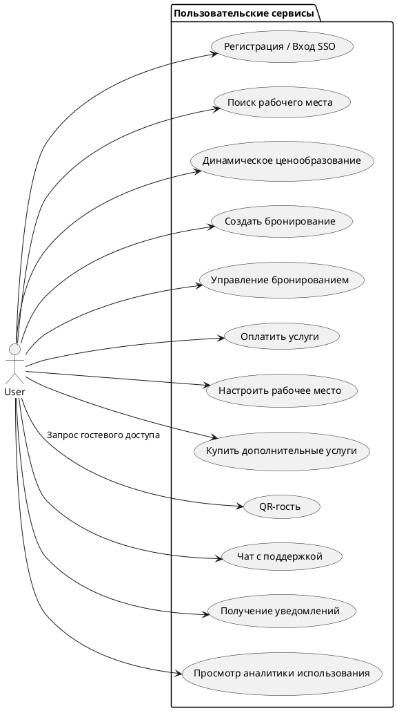

# Пользовательские функции

```plantuml
@startuml
left to right direction
actor User as U
package "Пользовательские сервисы" {
  U --> (Регистрация / Вход SSO)
  U --> (Поиск рабочего места)
  U --> (Динамическое ценообразование)
  U --> (Создать бронирование)
  U --> (Управление бронированием)
  U --> (Оплатить услуги)
  U --> (Настроить рабочее место)
  U --> (Купить дополнительные услуги)
  U --> (QR‑гость) : Запрос гостевого доступа
  U --> (Чат с поддержкой)
  U --> (Получение уведомлений)
  U --> (Просмотр аналитики использования)
}
@enduml
```
