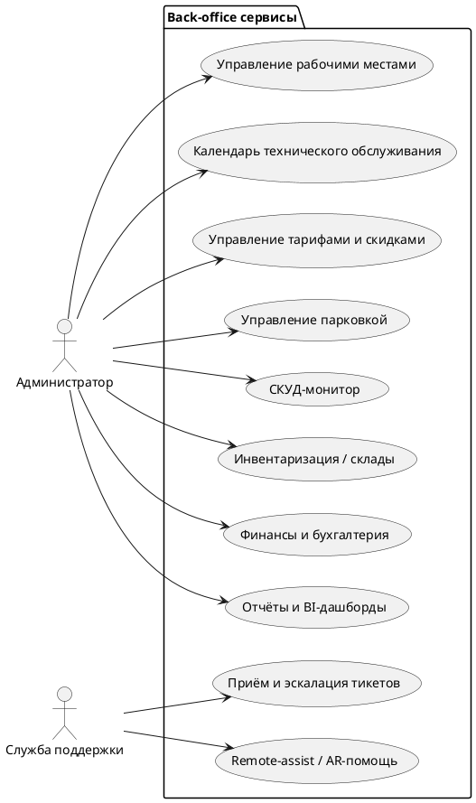

# Административные функции

```plantuml
@startuml
left to right direction
actor "Администратор" as A
actor "Служба поддержки" as S
package "Back‑office сервисы" {
  A --> (Управление рабочими местами)
  A --> (Календарь технического обслуживания)
  A --> (Управление тарифами и скидками)
  A --> (Управление парковкой)
  A --> (СКУД‑монитор)
  A --> (Инвентаризация / склады)
  A --> (Финансы и бухгалтерия)
  A --> (Отчёты и BI‑дашборды)
  S --> (Приём и эскалация тикетов)
  S --> (Remote‑assist / AR‑помощь)
}
@enduml
```
