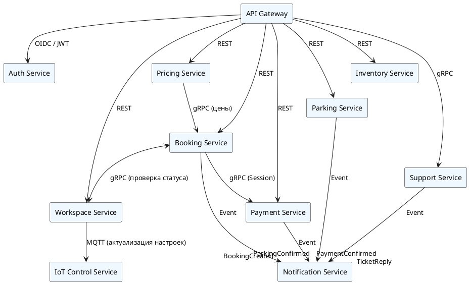

# Доменные сервисы

```plantuml
@startuml
skinparam rectangle {
  BackgroundColor #F0F8FF
  BorderColor black
}
rectangle "API Gateway" as GW
rectangle "Auth Service" as AUTH
rectangle "Workspace Service" as WS
rectangle "Pricing Service" as PRC
rectangle "Booking Service" as BK
rectangle "Payment Service" as PAY
rectangle "IoT Control Service" as IOT
rectangle "Parking Service" as PKG
rectangle "Inventory Service" as INV
rectangle "Support Service" as SUP
rectangle "Notification Service" as NTF
GW --> AUTH : OIDC / JWT
GW --> WS : REST
GW --> PRC : REST
GW --> BK : REST
GW --> PAY : REST
GW --> PKG : REST
GW --> INV : REST
GW --> SUP : gRPC
BK <--> WS : gRPC (проверка статуса)
BK --> PAY : gRPC (Session)
BK --> NTF : Event "BookingCreated"
PAY --> NTF : Event "PaymentConfirmed"
PRC --> BK : gRPC (цены)
WS --> IOT : MQTT (актуализация настроек)
PKG --> NTF : Event "ParkingConfirmed"
SUP --> NTF : Event "TicketReply"
@enduml
```
